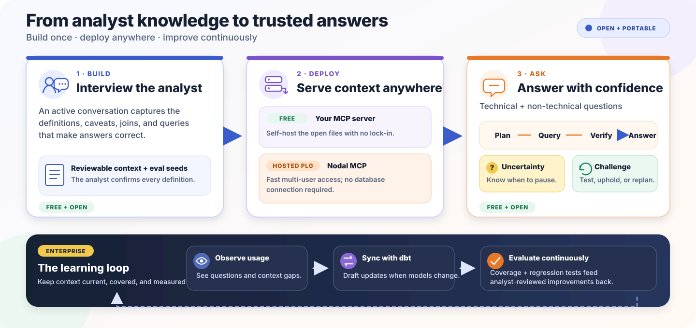

# Nodal Analytics

> Agent skills for building governed analytics context, planning data questions,
> and verifying the answers.

[Documentation](https://docs.nodaldata.io) ·
[Website](https://nodaldata.io) ·
[Analytics Context Format](./SPEC.md) ·
[Getting started](./docs/getting-started.md)

Analytics agents can write valid SQL and still give the wrong answer. They need
the definitions an experienced analyst carries around: what a metric means,
which table is canonical, which filters are mandatory, where joins fan out, and
when a result should be escalated instead of trusted.

Nodal turns that knowledge into reviewable context and reusable agent workflows.
An analyst remains the authority: the agent drafts, verifies, and records; the
analyst confirms.



## Installation (about a minute)

Choose one installation method per host. Installing both a native plugin and
skills.sh copies makes every skill appear twice and can cause ambiguous
invocation.

<details open>
<summary><strong>Claude Code</strong></summary>

```bash
claude plugin marketplace add nodal-data/nodal-context
claude plugin install nodal-analytics@nodal
```

To update an existing installation:

```bash
claude plugin marketplace update nodal
claude plugin update --scope user nodal-analytics@nodal
```

</details>

<details>
<summary><strong>Codex</strong></summary>

```bash
codex plugin marketplace add nodal-data/nodal-context
codex plugin add nodal-analytics@nodal
```

</details>

<details>
<summary><strong>Codex IDE, Cursor, and other skill-compatible agents</strong></summary>

```bash
npx skills@latest add nodal-data/nodal-context
```

This copies editable skills into your project. Select `setup-nodal` along with
the workflows you want to use.

</details>

## Where your data flows: nowhere new

Nodal's open-source package is a set of skills—instructions and local scripts
that run inside your own agent, on your own machine. There is no Nodal service
in the loop:

- **No data reaches Nodal.** Schema, query results, query history, dashboard
  captures, and the generated context all stay on your machine and in
  repositories you control. The package makes no network calls to Nodal and
  contains no telemetry.
- **No credentials reach Nodal.** Warehouse access happens through an MCP
  server you configure and authenticate yourself, using a read-only identity.
- **Your existing agent agreement is the only data flow.** Whatever your agent
  reads while answering a question is processed by the model provider behind
  your agent host—for example, Anthropic when you run on Claude Code—exactly as
  in any other use of that agent. Nodal adds no new data recipient.

Nodal's separate [hosted offering](#open-source-and-hosted-paths) is a paid
product that activates only when you opt in. Nothing in this package turns it
on, and no data reaches Nodal unless you become a hosted customer and connect
your context repository yourself.

## What you need before the first interview

> [!IMPORTANT]
> Nodal never handles warehouse credentials or sees your data—see
> [where your data flows](#where-your-data-flows-nowhere-new). Connect your
> agent to the warehouse through an approved MCP server using a read-only
> identity.

For the best initial context build, prepare:

- **A domain expert.** An analyst or other owner must confirm definitions. Nodal
  does not silently promote generated documentation to truth.
- **Read-only warehouse access.** The connection must support `SELECT` and
  metadata inspection. Nodal does not run DDL, DML, grants, or procedures.
- **Historical query-log visibility.** Full Stage 0 discovery needs access to
  query history across the relevant people, BI service accounts, and workloads.
  A connection that can see only its own queries can produce a misleadingly
  thin sample. If access is unavailable, the interview continues but records
  history mining as deferred or privilege-limited. Query-history permissions
  vary by warehouse: Snowflake usually needs
  `SNOWFLAKE.GOVERNANCE_VIEWER`, BigQuery needs project job-list visibility,
  and Redshift needs unrestricted system-log visibility. See
  [Getting started: historical query access](./docs/getting-started.md#historical-query-access)
  for the exact read-only grants, retention windows, fallbacks, and privacy
  caveats.

  Before the interview, run the probe for your warehouse (replace the bracketed
  BigQuery identifiers):

  <details>
  <summary><strong>Snowflake</strong></summary>

  ```sql
  SELECT
    CURRENT_USER() AS connected_user,
    CURRENT_ROLE() AS active_role,
    COUNT(*) AS visible_queries,
    COUNT(DISTINCT user_name) AS visible_users
  FROM SNOWFLAKE.ACCOUNT_USAGE.QUERY_HISTORY
  WHERE start_time >= DATEADD(day, -1, CURRENT_TIMESTAMP());
  ```

  </details>

  <details>
  <summary><strong>BigQuery</strong></summary>

  ```sql
  SELECT
    SESSION_USER() AS connected_user,
    COUNT(*) AS visible_queries,
    COUNT(DISTINCT user_email) AS visible_users
  FROM `<PROJECT>`.`region-<LOCATION>`.INFORMATION_SCHEMA.JOBS
  WHERE creation_time >= TIMESTAMP_SUB(CURRENT_TIMESTAMP(), INTERVAL 1 DAY);
  ```

  </details>

  <details>
  <summary><strong>Redshift</strong></summary>

  ```sql
  SELECT
    CURRENT_USER AS connected_user,
    COUNT(*) AS visible_queries,
    COUNT(DISTINCT user_id) AS visible_users
  FROM SYS_QUERY_HISTORY
  WHERE start_time >= DATEADD(day, -1, GETDATE());
  ```

  </details>

  A successful query confirms that the identity can read the history source.
  More than one `visible_users` is evidence of cross-user visibility; zero or
  one is inconclusive and should be treated as potentially privilege-limited.
- **Your dbt project, if you use dbt.** A local sibling checkout is recommended
  so the interview can draft from real models, tests, and metric definitions.
- **A dashboard in a local browser, if you want dashboard verification.** This is
  optional and is configured only with your consent.

## Set up a project

Run setup once from the project where you will use Nodal:

```text
# Claude Code
/nodal-analytics:setup-nodal

# Codex
$setup-nodal
```

Setup probes read-query, metadata, and query-history capabilities; discovers
nearby dbt and context sources; and can configure an optional local browser
binding after asking permission. It writes only sanitized capability
classifications and paths to a gitignored `.nodal.local.json`—never credentials,
tokens, or raw authentication errors.

Then ask the agent:

```text
Take Nodal for a test drive on one analytics domain.
```

The test drive uses five high-leverage questions and usually takes about 30
minutes. Use “build my analytics context” when you want the complete interview.
Both paths produce a reviewable context repository and eval seeds; unanswered
material remains visibly marked as draft.

For a concrete example, explore [Shorelane Commerce](https://github.com/shorelane-data/shorelane),
a fictional company with a public warehouse and deliberately ambiguous revenue
definitions, alongside its corresponding
[analytics context repository](https://github.com/shorelane-data/shorelane-analytics-context).
Together they show the evidence Nodal starts from and the reviewable context and
eval seeds produced by the interview.

See the [full setup and local exercise guide](./docs/getting-started.md) for MCP
options, permissions, configuration, and an end-to-end walkthrough.

## The workflows

The skills are small and composable. Use one directly, or let the agent route to
the appropriate workflow.

Nodal is designed to coexist with general engineering skill packs, including
[Matt Pocock’s skills](https://github.com/mattpocock/skills): those govern how
software is planned and built, while Nodal governs how business analytics
definitions and answers are established and verified.

### Build and maintain context

- [`setup-nodal`](./skills/setup-nodal/SKILL.md) configures project-local context
  sources, read-only warehouse capabilities, and optional browser access. It
  runs only when explicitly requested.
- [`context-interview`](./skills/context-interview/SKILL.md) interviews an
  analyst to build or improve an Analytics Context Format (ACF) repository. Each
  confirmed disambiguation also becomes an eval seed.
- [`analyst-handoff`](./skills/analyst-handoff/SKILL.md) captures critical domain
  knowledge when an analyst changes roles or transfers ownership. It orchestrates
  the governed interview rather than producing an unstructured transcript.

### Ask and verify

- [`analytics-plan`](./skills/analytics-plan/SKILL.md) translates a business
  question into a reviewable plan before any SQL runs. It can ground the plan in
  ACF, Kaelio KTX, dbt, local documentation, approved documentation MCPs, and
  warehouse evidence.
- [`verify-result`](./skills/verify-result/SKILL.md) checks executed SQL and
  results against the approved plan for metric, filter, grain, join, and time
  fidelity, then reports plausibility and escalation needs.
- [`challenge-result`](./skills/challenge-result/SKILL.md) gives a completed
  answer a skeptical second review when the user questions it or asks for
  another take. It either upholds the answer within the tested evidence,
  recommends escalation, or returns a corrected brief to `analytics-plan` for
  fresh approval.
- [`dashboard-verify`](./skills/dashboard-verify/SKILL.md) reads a named BI
  dashboard in the user's local browser, capturing both values and active
  filters for reconciliation.

The question-answering path is deliberately reviewable:

```text
business question → analytics plan → read-only query → result verification → answer
                                                                     ↓ if challenged
                                              independent challenge → uphold or replan
```

Plans and verified results include an explicitly uncalibrated uncertainty v0.
It records unresolved semantics and evidence gaps and recommends expert
escalation when a reliable answer cannot be supported. It is a decision aid, not
a statistical confidence score.

## Why these skills exist

Engineering agents can often inspect the artifact they are changing to answer
factual questions about the system. Analytics agents can inspect the warehouse,
but the warehouse cannot tell them which interpretation the business intended.
That is why engineering grilling commonly begins with a proposed change, while
analytics context building begins with the people who hold the definitions.

### 1. The agent knows the schema but not the business

Warehouses encode what can be queried, not what the company means by “active
customer,” “revenue,” or “conversion.” Nodal interviews the people who own those
definitions and stores the result in files the team can review by pull request.

### 2. Auto-generated context repeats existing ambiguity

Raw schemas, prior SQL, and BI metadata are useful evidence, but they are not
authority. Anthropic's data team reported that automatically generated metric
definitions encoded the ambiguities they were trying to remove and performed
worse than a smaller human-curated layer. Their agent also gained less than one
point of accuracy from access to thousands of prior queries.
[Read Anthropic's case study](https://claude.com/blog/how-anthropic-enables-self-service-data-analytics-with-claude).

Nodal uses schema, dbt, dashboards, and query history to create drafts and
surface conflicts. A human decides which interpretation is correct.

### 3. A successful query is not a verified answer

SQL can execute successfully at the wrong grain, omit a mandatory filter, use a
noncanonical metric, or fan out through a join. `analytics-plan` makes intent
explicit before execution; `verify-result` checks whether the query and result
actually satisfy that intent afterward.

## Bring the context you already have

ACF is readable Markdown and YAML, defined by [`SPEC.md`](./SPEC.md). It is the
native authoring format, but it is not a lock-in boundary. The format-agnostic
[evaluation harness](./eval_harness/INTERFACE.md) can normalize ACF, Kaelio KTX,
dbt models and docs, raw Markdown, or an agent data-analysis skill and measure
the accuracy delta with context on versus off.

The five-question test drive is also a practical way to create the labeled seeds
needed to evaluate context you already maintain in another format.

## Open source and hosted paths

Everything that runs on your machine is Apache-2.0 open source: the context
format, the seven skills, local one-shot evaluation, dashboard verification,
generated context repositories, and self-hosted use. Your context repository is
ordinary git—share it with your team the way you already share code, at no
cost.

The hosted path is a separate, paid product that activates only when you opt in
and connect your context repository to it: a hosted MCP endpoint that delivers
your context team-wide, and an enterprise learning loop for observability,
coverage, regression testing, and dbt synchronization. That connection is also
the first and only point at which any data reaches Nodal.

## Repository reference

```text
nodal-context/
├── skills/                    # the seven installable agent workflows
├── SPEC.md                    # Analytics Context Format specification
├── schemas/                   # machine-validatable ACF schemas
├── template/                  # generated context-repository scaffold
├── examples/                  # worked ACF examples
├── eval_harness/              # format-agnostic evaluation runner
├── scripts/integration/       # opt-in clean-room release harness
├── .claude-plugin/            # Claude plugin and marketplace metadata
└── .codex-plugin/             # Codex plugin metadata
```

Maintainers should use the
[clean-room integration guide](./scripts/integration/README.md) for source,
installed-plugin, skills.sh, warehouse, dashboard, and resume testing. Private
briefs, MCP configuration, browser profiles, credentials, and host-specific
settings must remain local and ignored.

## License

Apache-2.0. The format and the interview-built context are yours to keep.
